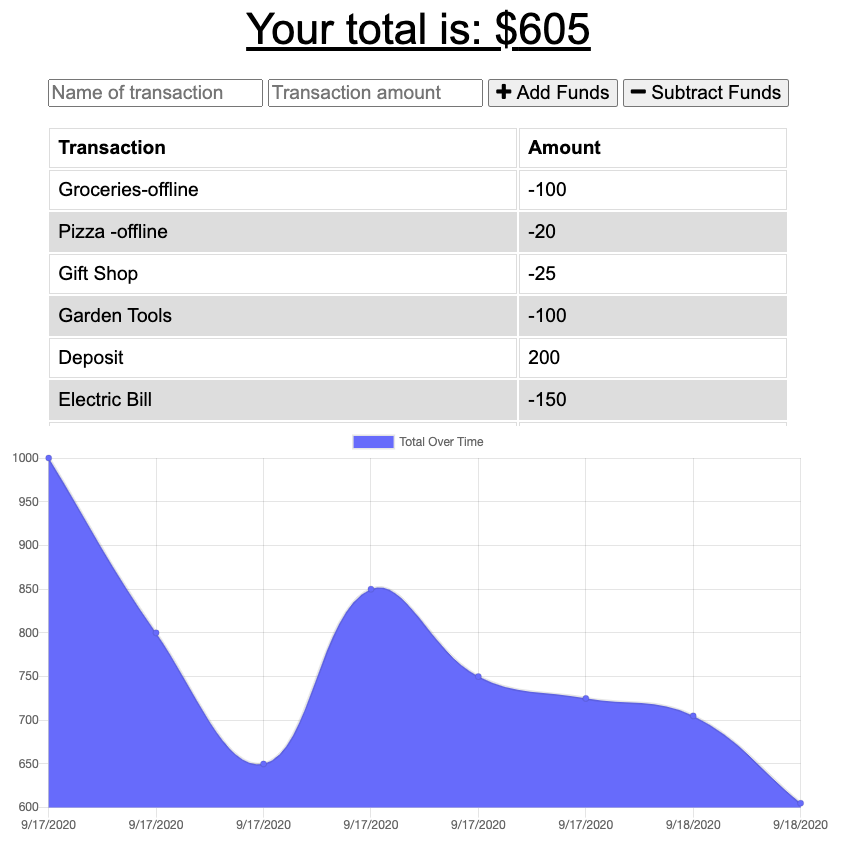

<h1>Budget-Tracker</h1>
<h2>John Manouse</h2>

I created an application that will allow a user to input various budget transactions into an application regardless of being online or offline. Once the user creates an expense, or deposit transaction, the app will cache the information, if the user has no current connection, and will update once the user is back online. The application will use the Service-Worker, and Cache API to cache data so the application will function without an internet connection.

 
<h2>Budget Tracker Summary</h2>
<ul>
    <li>HTML code</li>
    <li>CSS</li>
    <li>Javascript</li>
    <li>node.js</li>
    <li>Express</li>
    <li>IndexedDB</li>
    <li>cache API</li>
    
</ul>

<h2>Pull Requests welcome for contribution</h2>

John Manouse

Live Link: <a href="https://budget411.herokuapp.com/"
>Budget-Tracker Live Link</a>

Github: <a href="https://github.com/Mirageg4/Budget-Tracker">Budget-Tracker Repo</a>

              

License: Project is licensed under the MIT License. 
See <a href ="LICENSE.md">LICENSE</a> file for details.